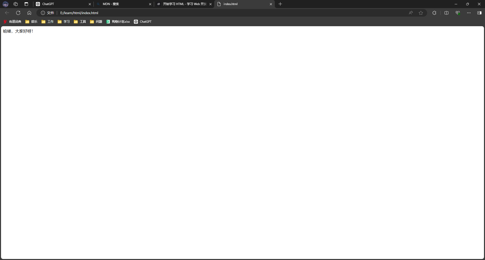

## 是什么？

以制作一份报纸为例，工作人员根据作者的原稿，通过印刷机制作出一份报纸。

也可以用相同的流程来解释 HTML 与浏览器的关系，浏览器与报纸一样，都是内容的载体，把内容展示给读者的。

浏览器内部会根据开发人员编写的 HTML，通过浏览器生成一个网页。

HTML 用来指定浏览器的内容是什么，网页中的内容是多种多样的，如表格、图片、表单、视频、音频等等。

## 由哪几部分组成？

HTML 是由许多元素组成的，例如网页中的表格需要用到表格元素；填写的表单需要用到表单元素；一张图片需要用到图片元素等等。并不是说只需要一种元素就可以展示各种内容。

下面这个代码就是一个元素，先不考虑它属于哪种类型的，先来认识一下元素的结构：

```html
<p>哈喽，大家好呀！</p>
```

元素是由**标签**和**展示的内容**组成，标签用于确定元素的类型，展示的内容就是在浏览器网页上用户能看到的内容。

**\<p>**和**\</p>**是标签，一般标签有两个，一个是不带斜杠 `/` 的，一个是带斜杠 `/` 的，不带斜杠的 **\<p>** 叫做开始标签，带斜杠的 **\</p>** 叫做结束标签。

**哈喽，大家好呀！**是展示的内容。

展示的内容必须被开始标签和结束标签包裹住，开始标签在前，结束标签在后。

在浏览器网页上，**标签**不会展示给读者，只会把**展示的内容**展示给读者。

如图：

